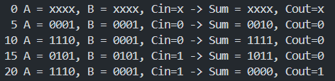

# 4-Bit Ripple Carry Adder (RCA)

This is a **Verilog implementation of a 4-bit Ripple Carry Adder (RCA)**.  
It includes:
- A 1-bit Full Adder module
- A 4-bit Ripple Carry Adder built from full adders
- A testbench for functional verification
- Example waveform outputs

## How to Run
1. **Compile using Icarus Verilog:**
   ```
   iverilog -o rcaoutput rca.v testb.v
   ```
2. **Run the simulation**
   ```
   vvp rcaoutput
   ```
3. **View the Waveform on GTKWave**
   ```
   gtkwave rcatest.vcd
   ```
# TestBench Result


# Waveform
